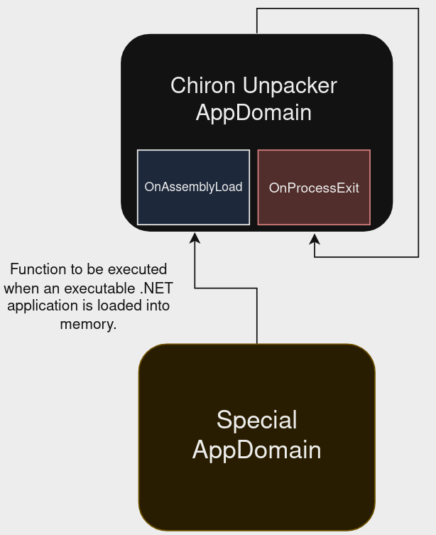

# Chiron Unpacker

> [!CAUTION]
> Since the application to be unpacked is run directly, **it must be run in a secure environment (VM)**.


## About

**Chiron Unpacker** is an Unpacker for Packers that uses the `Assembly.Load(byte[] rawAssembly)` function. Chiron Unpacker creates a special AppDomain and handles the Assembly.Load calls in this AppDomain. This allows us to handle all executable .NET applications loaded into memory after they are loaded.

This project was developed by the Malwation Threat Research team to completely unpack the **Cassandra Protector**. Since this protection includes **ConfuserEx Constant Encryption** operations, it can also decrypt ConfuserEx constants at runtime if necessary.

However, we have made the stage related to Cassandra Protector optional. If you have encountered a packer that uses the `Assembly.Load(byte[] rawAssembly)` function, you can save each module loaded into memory in the directory of your choice without using this feature.

## Usage

[Latest Release]()

```
Chiron Unpacker by Malwation
Chiron-Unpacker 1.0.0.0
Copyright c 2024

    -f, --file        Required. Select the file to unpack

    -o, --output      Required. Select the location to save the dumped files

    -r, --resource    (Default: false) Use ResourceUnpack feature

    --help            Display this help screen.

    --version         Display version information.
```

Example command:

```
Chiron-Unpacker.exe -f sample.exe -o .\output_folder\ -r
```

## How It Works

It saves executable .NET applications loaded into memory by opening a special AppDomain where `Assembly.Load` events are controlled. When it is run on the packed application sample using the ResourceUnpack feature, the following operations are performed respectively:

1. Creates a custom AppDomain that controls Assembly Load events.
2. Controls ProcessExit events in the main AppDomain (at this stage, if the ResourceUnpack feature is activated, the next stage is started).
3. Execute the given file inside the created custom AppDomain.
4. Saves all .NET assemblies loaded into memory in the custom AppDomain.



## Example of How It Works

For example, in the video below you can see a sample of an **OriginLogger** protected with **Cassandra Protector**.

This protection repeatedly loads modules into memory to unpack the protected application. Chiron saves all assembly modules loaded into memory and completely unpacks them using the Resource Unpack feature (exclusive to Cassandra Protector).


## Third Party Libraries

| Library                                                         | License |
| --------------------------------------------------------------- | ------- |
| [CommandLine](https://github.com/commandlineparser/commandline) | MIT     |
| [dnlib](https://github.com/0xd4d/dnlib)                         | MIT     |

